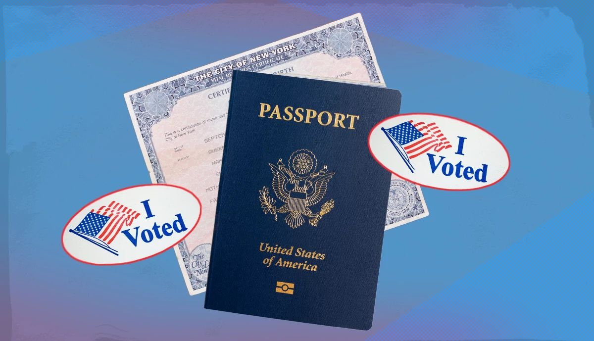

## Title Slide

- Turn off alarm
- Get out of bed

## Introduction

<iframe src="charts/map_dash.html" width="1200" height="600"></iframe>

## Real World Implications
- Suppression of women’s right to vote is no longer a radical provocation, but a true threat, demonstrated by the ***Safeguard American Voter Eligibility (SAVE) Act***. 
 
{fig-align="center" width="800"}

## SAVE Act Overview
  - Passed in the House several times, including in February 2026. Remains up for a vote in the Senate as of April 2026.
  - Requires in-person proof of citizenship for voter registration or registration updates through a passport or birth certificate. 
  - Leads to an additional barrier to voting for many women, who are far more likely to take their spouse’s name, increasing the risk that their birth certificate does not match their legal name. 

## State-Level Analysis
To explore which women would be most impacted by the SAVE Act, we aligned state estimates of female citizens whose names may not match their birth certificates with state survey results from the National Opinion Research (NORC).

## Rurality vs. Estimated Women at Risk
<iframe src="charts/Percent_of_Women_At_Risk_vs_Percent_of_Women_Living_in_Rural_Areas.html" width="1200" height="900"></iframe>

## Republican Party Identity vs. Estimated Women at Risk
<iframe src="charts/Percent_of_Women_At_Risk_vs_Percent_of_Women_Who_Identify_as_Republican.html" width="1200" height="900"></iframe>