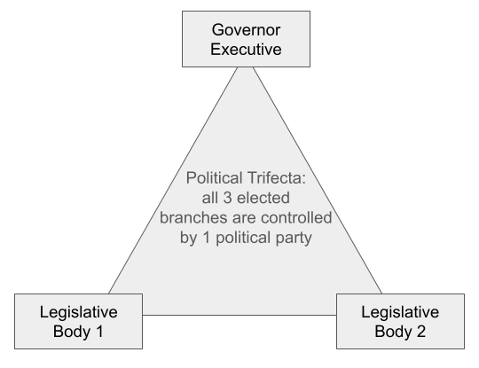
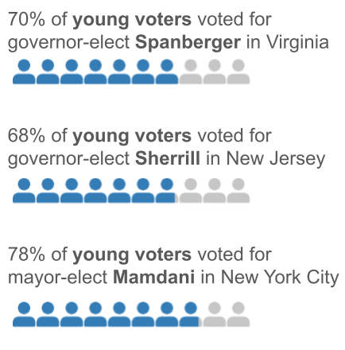
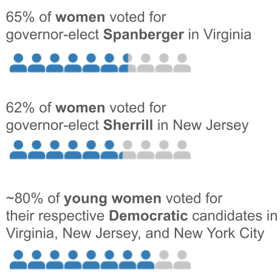
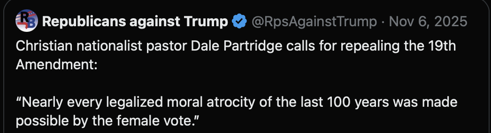
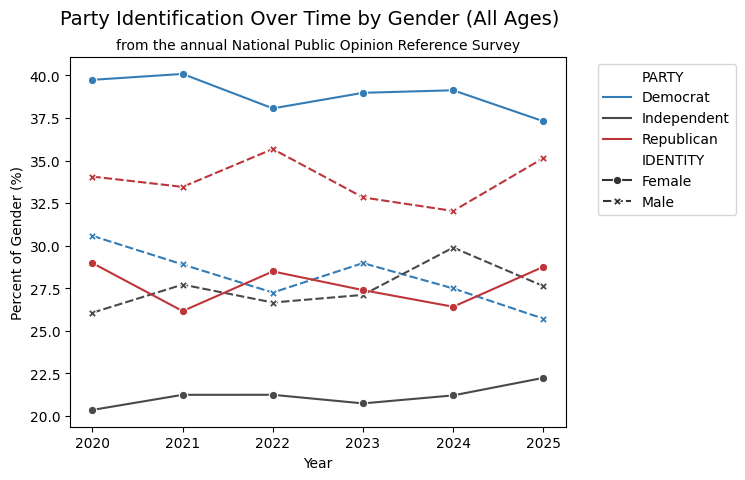
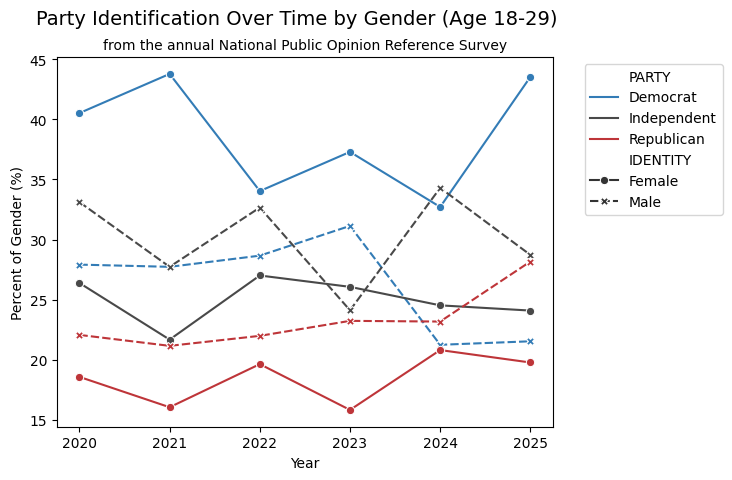
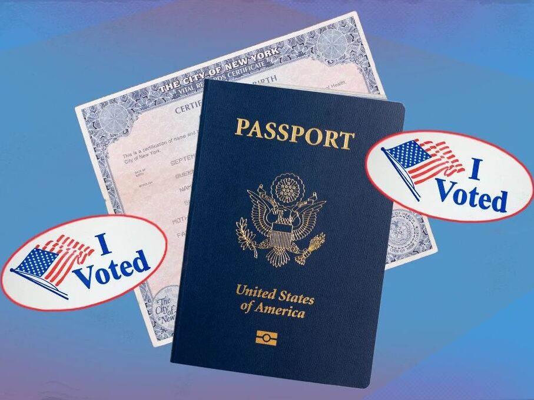
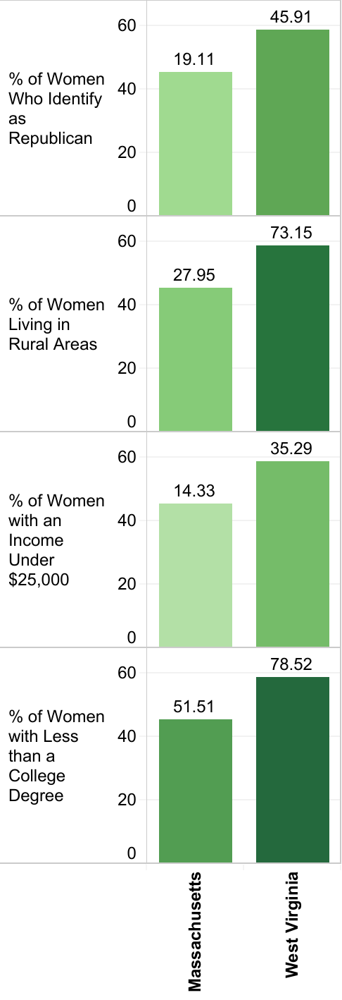

# Introduction

## Shift in Political Climate

* Political pendulum swing - cyclical power shift between opposing parties
* Thermostatic model of public opinion - public opinion shifts in response to political action being "too left" or "too right"
* Presidential elections are notable examples of this
* We can see signs of the pendulum continuing to swing even in recent local elections

## November 4, 2025 : The Stakes
::: columns

::: {.column width="50%"}

* First major elections since the 2024 Presidential election
* Virginia, New Jersey, New York City
* Widely televised and commentated across all news networks
* Virginia gained a Democratic trifecta, New Jersey held a Democratic trifecta
* President backed Cuomo against Mamdani: Mamdani victory

:::

::: {.column width="50%"}

  

:::

:::

## November 4, 2025 : The Voters
::: columns

::: {.column width="50%"}

:::

::: {.column width="50%"}

  

:::

:::

## Social Media Backlash

Blaming young women voters

## Social Media Backlash

"Women as individuals shouldn't be able to vote"

# Political Gender Split

## Gender Split Over Time

::: columns

::: {.column width="35%"}

* The greatest proportion of women identify as Democrat
* The greatest proportion of men identify as Republican
* Women and men in the United States have different political interests and identities, particularly in the last 5 years

:::

::: {.column width="65%"}

  

:::

:::

## Split in Young Voters

::: columns

::: {.column width="35%"}

* This split is more dramatic in young voters, but less stable
* Since the 2024 election, a higher proportion of young women identify as Democrat, and a higher proportion of young men identify as Republican
* How is this split represented in political issues?

:::

::: {.column width="65%"}

  

:::

:::

## Gender Split on Political Issues

<iframe src="charts/issues_dashboard.html" width="1200" height="600"></iframe>

## The Hypothetical

What if women did not vote in the 2024 election?

<iframe src="charts/map_dash.html" width="1200" height="600"></iframe>

# Real World Implications

## Real World Implications
:::: {.columns}

::: {.column width="60%"}
*   Suppression of women’s right to vote is no longer a radical provocation, but a true threat, demonstrated by the ***Safeguard American Voter Eligibility (SAVE) Act***.
*   Passed in the House several times, including in February 2026. Remains up for a vote in the Senate as of April 2026.
:::

::: {.column width="40%"}

:::

:::: 

## SAVE Act Overview
  - Requires in-person proof of citizenship for voter registration or registration updates through a passport or birth certificate. 
  - Leads to an additional barrier to voting for many women, who are far more likely to take their spouse’s name, increasing the risk that their birth certificate does not match their legal name. 
  - Research suggests that it may disproportionately impact women living in **rural areas, conservative women, low-income women, older women, and women with less education.**

## Overall Statistics
- **49%** of Estimated Americans without a valid passport
- **69 Million** 
- **80%** of Americans with an income below $50,000 without a valid passport
- **75%** Americans with less than a college education without a valid passport

## State-Level Analysis
* To explore which women would be most impacted by the SAVE Act, we aligned state estimates of female citizens whose names may not match their birth certificates with state survey results from the National Opinion Research (NORC).
* Note: Delaware was excluded from the folllowing charts because its estimated value is a clear outlier and may reflect instability from limited survey responses rather than a comparable state-level pattern.

## State-Level Analysis: Rurality
<iframe src="charts/Percent_of_Women_At_Risk_vs_Percent_of_Women_Living_in_Rural_Areas.html" width="1200" height="900"></iframe>

## State-Level Analysis: Party Identity
<iframe src="charts/Percent_of_Women_At_Risk_vs_Percent_of_Women_Who_Identify_as_Republican.html" width="1200" height="900"></iframe>

## Massachussetts vs. West Virginia
:::: {.columns}

::: {.column width="80%"}

<iframe src="charts/Massachusetts_vs_West_Virginia.html" width="800" height="600"></iframe>

:::

::: {.column width="20%"}

:::

:::: 

## Conclusion
* Social media backlash after recent elections targeted **young women** who voted for **Democratic** candidates
* SAVE act legislation requires expensive additional documents, like passports, for citizens with a **name change**
* SAVE act puts women living in **rural areas, conservative women, low-income women, older women, and women with less education** at risk of losing their **right to vote.**
* Discussion question: What issues do you think would be affected if fewer women vote in the next major election?
