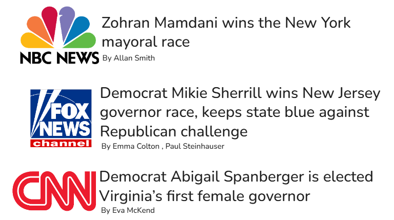
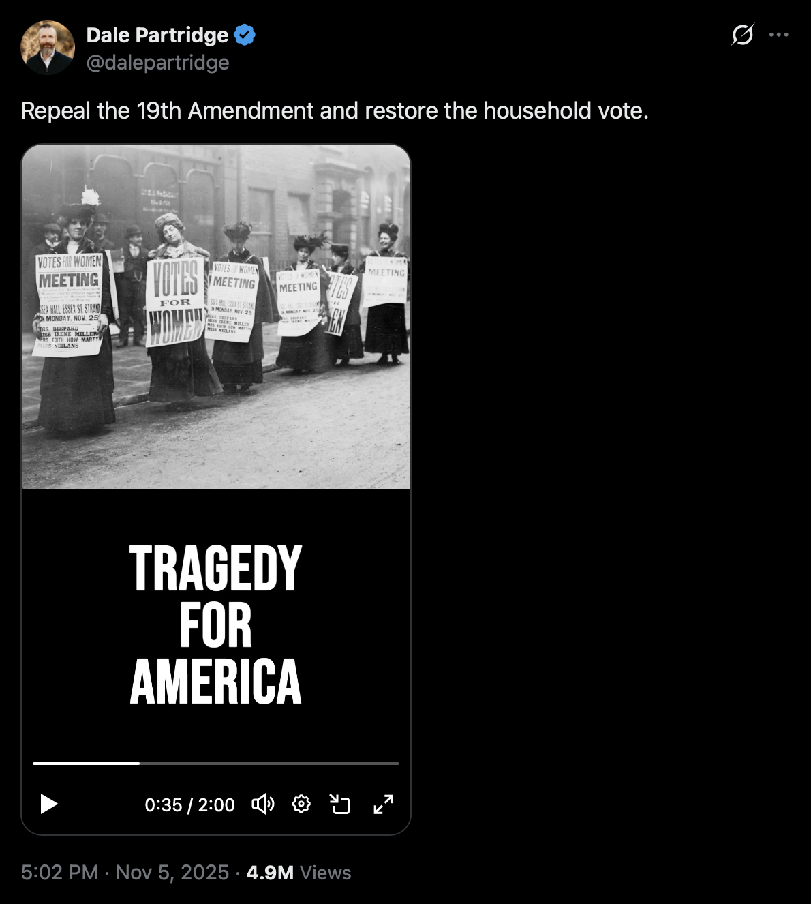
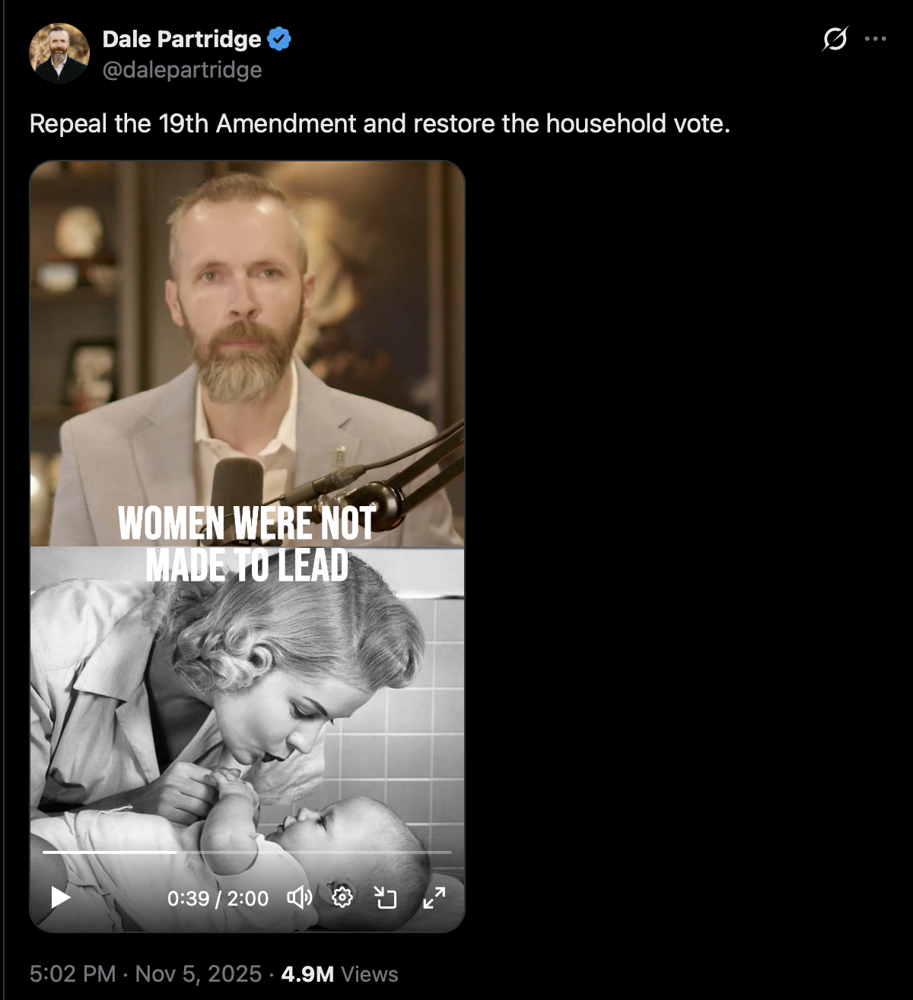
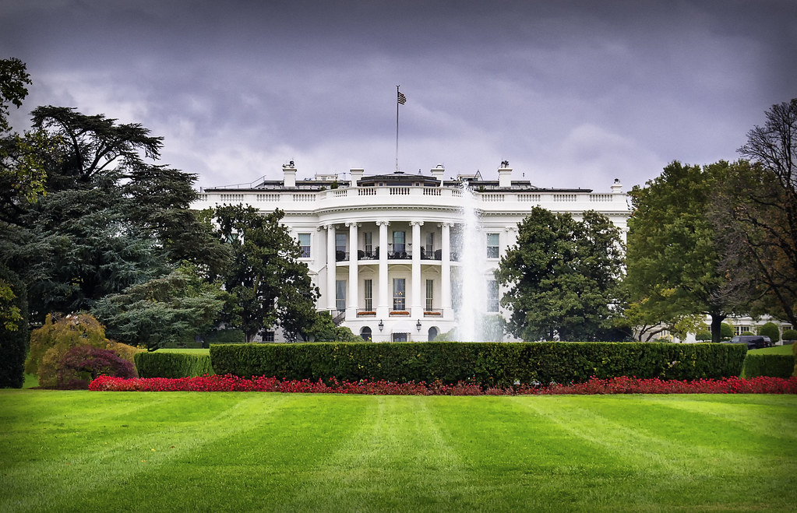
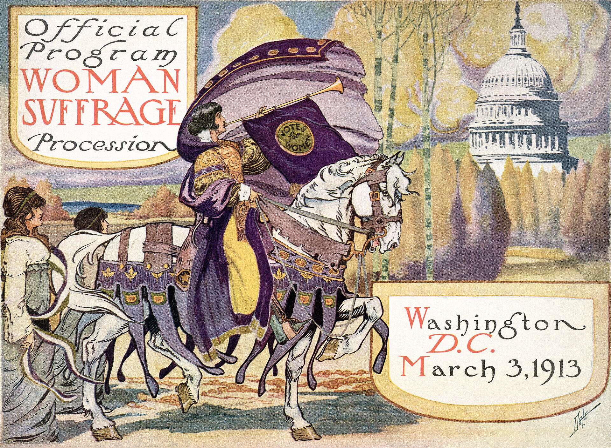
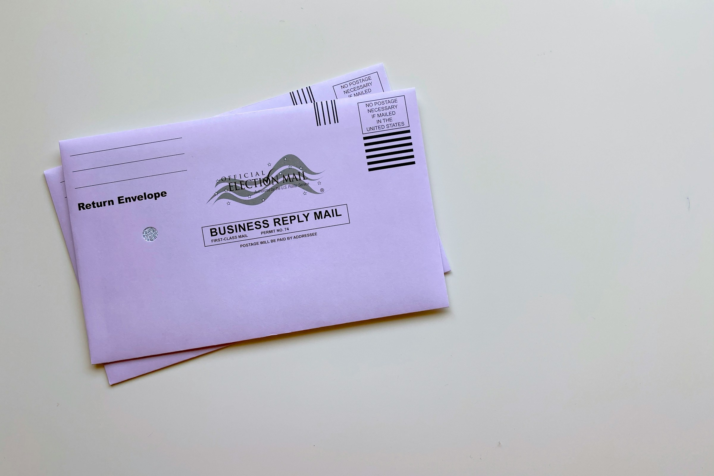
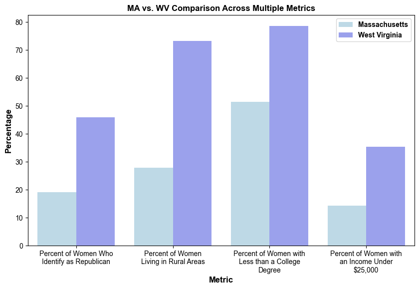
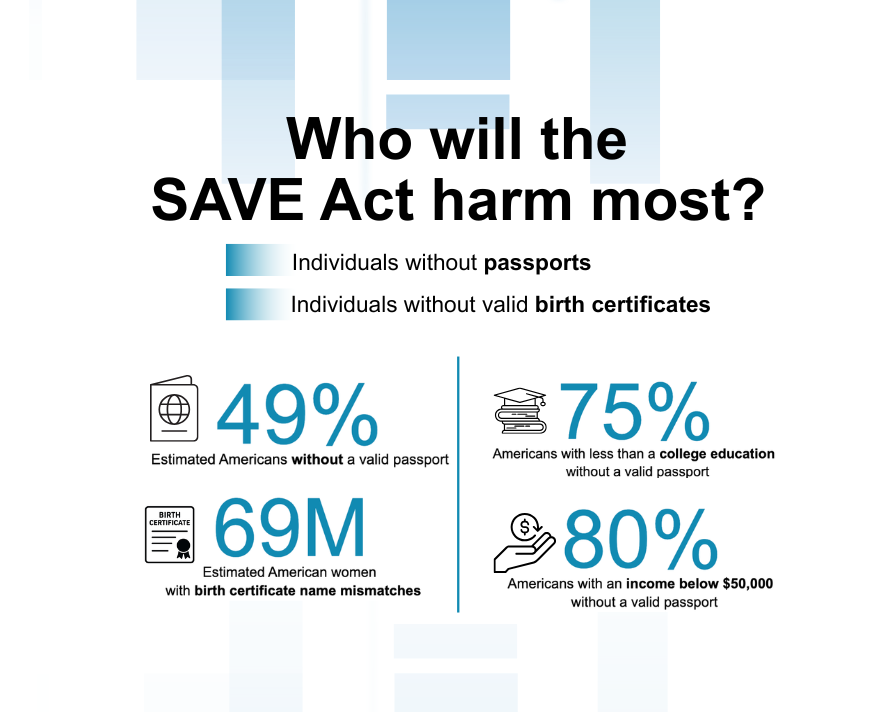

:::{.cr-section}

Have you ever heard of the “swinging pendulum” in politics?

@cr-features-intro_text

It refers to the cyclical power shift between opposing political ideologies. It’s particularly common in two-party political systems (like the one we have in the U.S.).

This is more than just an anecdotal observation. In 1995, political scientist Christopher Wlezein found something he called the thermostatic model of public opinion. 

@cr-two_party

Wlezein found that the public acts as a thermostat, adjusting its political demands in response to government action. When policies become too liberal, public opinion moves to the right; if they become too conservative, the public moves left [@wlezien1995].

Through this mechanism, the public provides necessary feedback for democratic accountability [@wlezien1995]. 

@cr-white_house

It’s no secret that the U.S. has experienced the swinging pendulum. Even if we just take a broad look at our Presidential election results in the past decade, we can see this pendulum swinging. 

In response to the most recent Presidential election, we have seen a continuation of this swinging pendulum in some recent local elections. 

@cr-features-election_text

:::{.cr-step .compact-step}
## Recent Local Elections
November 4, 2025 was the first major election night since the Presidential election in 2024. For the Democratic Party, this was also the first opportunity to gain control of state and local offices after the Republican win for presidency. 
:::

@cr-features-news_headlines

That day, Virginia and New Jersey held state-level elections for their executive offices and some legislative offices, and New York City held its mayoral election. All three races were widely anticipated [@Bradner_2025b] and closely followed by various news outlets, including NBC News, Fox News, and CNN.

@cr-features-trifecta

The two state elections generated so much interest because a ‘Democratic trifecta’ was on the line. A political trifecta occurs when a single political party controls all three major elected components of a state’s government, which usually makes it easier for that party to pass policies. 

@cr-features-va_trifecta

In Virginia’s case, the governor before the elections was Republican, and the two legislative bodies were controlled by the Democratic party. If a Democrat was elected for governor, Virginia would achieve a Democratic trifecta. 

@cr-features-nj_trifecta

New Jersey held a Democratic trifecta before election night, but the races for governor and legislative offices were so close that they had a possibility of losing Democratic control in one of the branches.

@cr-features-mamdani

The New York City race was widely followed for many reasons, including the Democratic Party’s reluctance to back their candidate, Zohran Mamdani, and the support from the President of the United States to the Independent candidate, Andrew Cuomo. 

@cr-features-election_results

All three elections resulted in dramatic Democratic party wins, with Virginia and New Jersey achieving Democratic trifectas, and Zohran Mamdani winning in New York City. In the aftermath of this busy election night, election analysts reviewed exit polling data and learned two important things:

@cr-features-young_votes

The majority of **young people** voted for winning Democratic candidates in all 3 elections [@McHardy_2025].

@cr-features-female_votes

The majority of **women** voted for winning Democratic candidates in all 3 elections, especially **young women** [@Dittmar_2025].

@cr-features-social_media

:::{.cr-step .compact-step}
## Social Media Backlash
In response to these local elections, there was a lot of backlash on social media. Of particular note was the backlash that young women voters seemed to face, given that many of them voted for these Democratic candidates who eventually won these races. 
:::

@cr-repeal-19th-2

A noteworthy example of this can be found from Dale Partridge’s X account, where he posted a video advocating for the repeal of the 19th amendment, just one day after the November 4th elections. 

@cr-womens_suffrage

The 19th amendment essentially gave women the right to vote. After decades of the women’s suffrage movement, the 19th amendment passed, prohibiting elections from denying citizens the right to vote on the basis of sex.

@cr-repeal-19th-5

In the video included in this X post, Dale Partridge calls to restore the household vote in favor of the 19th amendment, whereby women would “share their thoughts with their fathers or husbands and the men in their lives would make the final decisions.”[@partridge2025]

@cr-repeal-19th-4

He justifies this change by implying that social progressivism has been the result of the female vote.

“Nearly every legalized moral atrocity in the last 100 years was made possible by the female vote. Abortion and homosexuality would likely still be illegal if not for the female vote… even last night the new Muslim NYC mayor Mamdani specifically won because of the female vote.”[@partridge2025]

@cr-repeal-19th-3

A few months earlier in August 2025, Pete Hegseth, who at the time was the U.S. Secretary of Defense, reposted a separate but ideologically similar video on X. This video, a segment from CNN, featured several Christian pastors who advocated for the repeal of the 19th amendment in favor of a household vote [@hegseth2025].

@cr-repeal-19th-6

This is just a snippet of the many ideas espoused by Christian pastor Doug Wilson and his community who are strongly advocating for a more patriarchal society. Importantly, as noted by the CNN segment, one of Doug Wilson’s contacts is Pete Hegseth himself, “his highest level connection to the [Trump] administration” [@hegseth2025].

@cr-features-gender_split

:::{.cr-step .compact-step}
## Political Gender Split Over Time
If women were so influential in this past election, and prominent men called to rescind women's right to vote, how do women and men in the United States identify politically? 

The National Public Opinion Reference Survey is an annual survey of adults in the United States, distributed by Pew Research Center [@pew2025npors]. From 2020 to 2025, survey respondents were asked what political party they identify with. The following chart shows those responses over time. 
:::

@cr-features-age_lines

Throughout this time period, the largest proportion of **women (~35-40%) identify as Democrat,** while the largest proportion of **men (~32-35%) identify as Republican.** This indicates that a large population of women have very different political identities and interests than a similarly large population of men. 

@cr-features-youth_lines

In the same time period, the survey responses for young adults are more complex. Despite dramatic changes each year, the largest proportion of **young women** in any time period identify as **Democrat**, and the largest proportion of young men identify as either Democrat or Independent. 

However, from 2024-2025, there is a visible disparity where the proportion of **young men who identify as Republican increased** (~22% to ~27%), and the proportion who identify as Independent decreased (~35% to ~27%). At the same time, the proportion of **young women who identify as Democrat dramatically increased** (~34% to ~44%).

The NPORS survey has not been issued long enough to calculate trends over time for these survey responses. However, they do provide a visual representation of the differences in political identity between women and men. How do these differences in political identity appear in the issues that women and men care about?

:::{#cr-features-intro_text}

:::

:::{#cr-features-election_text}

:::

:::{#cr-features-news_headlines}

:::

:::{#cr-features-trifecta}

:::

:::{#cr-features-va_trifecta}

:::

:::{#cr-features-nj_trifecta}

:::

:::{#cr-features-mamdani}

:::

:::{#cr-features-election_results}

:::

:::{#cr-features-young_votes}

:::

:::{#cr-features-female_votes}

:::

:::{#cr-features-social_media}

:::

:::{#cr-features-gender_split}

:::

:::{#cr-features-age_lines}

:::

:::{#cr-features-youth_lines}

:::

:::{#cr-repeal-19th-1}

:::

:::{#cr-repeal-19th-2}

:::

:::{#cr-repeal-19th-3}
{width="70%"}
:::

:::{#cr-repeal-19th-4}
{width="60%"}
:::

:::{#cr-repeal-19th-5}
{width="60%"}
:::

:::{#cr-repeal-19th-6}
{width="60%"}
:::

:::{#cr-two_party}
{width="60%"}
:::

:::{#cr-white_house}
{width="80%"}
:::

:::{#cr-womens_suffrage}
{width="80%"}
:::

:::

## Political Gender Split by Issue

Let’s zoom in on the survey responses from the most recent year, in 2025. 

When examining what issues were important to respondents, there was a clear gender split in which issues mattered to who. To explore this, we will click on one of the issues and then select a slice of the pie that pops up.

::: {#fig-issues-dashboard}
<iframe src="charts/issues_dashboard.html" style="width: 100%; height: 850px; border: none;"></iframe>

Source: @pew2025npors
:::

Let’s take a look at how men vs. women responded to the question about how safe they felt from crime. Most of the people who said they felt extremely safe were men, and most of the people who said they did not feel safe at all were women. 

What about people’s rating of the current economic state? In a similar fashion, we can see that mostly men said they thought economic conditions were excellent, while mostly women said they thought they were poor.  

While these are not statistical associations, we can see that there is a clear split in how men vs. women respond to some of these issues. Go ahead and explore more of the available issues to investigate whether this pattern holds for other areas.

:::{.cr-section}

@cr-features-gender_split_2

:::{.cr-step .compact-step}
## The Hypothetical
Prominent figures like the Secretary of War declared that women should not have the right to vote. If that happened, women's interests in all of these issues would be underrepresented, and the United States would have a very different political landscape. For example, what would the 2024 Presidential Election have looked like if women did not vote?
:::

:::{#cr-features-gender_split_2}
![[@wikimedia2024]](charts/election2024.jpg){width="80%"}
:::

:::

This map shows the AP VoteCast exit poll responses to the 2024 election. This survey is hosted by the National Opinion Research Center, at the University of Chicago. The state coloration shows the majority opinion from survey respondents, and does not represent the final electoral college or popular vote of the states. Click a state on the left to see an age-group breakdown of the responses in that state on the right. 

To see what the 2024 election would have looked like if women did not vote, toggle the map from "Total" to "Male," and check out the "Female" tab to see how women voted in each state.

::: {#fig-issues-dashboard}
<iframe src="charts/map_dash.html" style="width: 110%; height: 900px; border: none;"></iframe>

Source: @apnorc2025votecast
:::

When considering the total survey responses, a roughly even number of states are colored blue (majority Harris) and red (majority Trump). However, considering only male survey responses shows most of the states turn red. By contrast, considering only female survey responses, most states turn blue. This shows that, in most states, there is a divide between how men and women voted, and while Donald Trump won the 2024 election regardless, the margin would have been much larger if women did not vote.

:::{.cr-section}

@cr-features-save_act_text

So far, we've discussed the hypothetical impacts of suppressing women's right to vote. While a complete repeal of the 19th amendment is unlikely, there are real legislative efforts to suppress women and other groups from exercising their right to vote.

:::{.cr-step .compact-step}
## The Safeguard American Voter Eligibility Act (SAVE) Act
The absence of women's perspectives in politics is no longer a radical provocation, but a true threat, demonstrated by the Safeguard American Voter Eligibility (SAVE) Act.
:::

@cr-passport

:::{.cr-step .compact-step}
The SAVE Act would require voters to provide proof of citizenship in person upon voter registration through a valid **passport** or **birth certificate.**

REAL IDs would ***not*** suffice as citizenship proof for the vast majority of Americans, since they demonstrate legal residence and are available to non-citizens.
:::

@cr-marriage-certificate

This requirement would create an additional barrier to voting for many women, who are far more likely to take their spouse’s name, increasing the risk that their birth certificate does not match their legal name. 

A Pew Research study @pew2023 found that women in opposite-sex marriages are far more likely than men to take their spouse’s last name, though younger, Democratic and highly-educated women are less likely to do so. For women with birth certificates that do not match their current legal names, registering to vote would necessitate additional documentation, such as a marriage certificate.

@cr-election-mail

:::{.cr-step .compact-step}
## Additional Barrier to Vote for Rural Individuals

The SAVE Act's in-person requirement would pose a greater burden for women living in rural areas, farther from voting locations, requiring some to travel hours or even fly to prove citizenship.

It would effectively end online and mail-in registration, which are more commonly used by rural voters.
:::

:::{.cr-step .compact-step}
The legislation would also increase the burden of voting for as many as **47%** of U.S. citizens without a passport. @state2024passportissuance

Research from the Center for American Progress shows that passport ownership is concentrated in blue states and among **highly-educated individuals, individuals with higher incomes, and younger individuals.** @saveactfactsheet
:::

@cr-features-save_act_rally

:::{.cr-step .compact-step}
Together, these data points indicate that if passed, the SAVE Act could disproportionately impact women living in rural areas, conservative women, and low-income, older women with less education.
:::

:::{#cr-features-save_act_text}

:::

:::{#cr-features-save_act_rally}
{width="70%"}
:::

:::{#cr-passport}
{width="70%"}
:::

:::{#cr-marriage-certificate}
{width="40%"}
:::

:::{#cr-election-mail}
{width="80%"}
:::

:::

## Analysis of State-Level Impacts

To explore which women would be most impacted by the SAVE Act, we aligned the Center for American Progress's estimates of female citizens whose names may not match their birth certificates with state survey results from the AP VoteCast 2024 General Election survey [@apnorc2025votecast] and female population data from the U.S. Census Bureau [@estimated2024acs].

The following state-level scatterplots show relationships between estimated birth-certificate name mismatch risk, rurality, and party identification.

::: {#fig-rurality}
<iframe src="charts/Percent_of_Women_At_Risk_vs_Percent_of_Women_Living_in_Rural_Areas.html" 
style="width: 830px; height: 620px; border: none;">
</iframe>

Source: @apnorc2025votecast
:::

We can see a clear state-level association between rurality and birth-certificate mismatches. Higher estimated shares of women with birth-certificate name mismatches coincide with higher shares of women living in rural areas. 

This is particularly concerning, since, as we've already discussed, the SAVE Act's in-person requirement would disproportionately impact women living in rural areas.

::: {#fig-republican}
<iframe 
src="charts/Percent_of_Women_At_Risk_vs_Percent_of_Women_Who_Identify_as_Republican.html" 
style="width: 830px; height: 620px; border: none;">
</iframe>

Source: @saveactfactsheet
:::

While the visual pattern is less pronounced, we also observe an association between Republican party identity and birth-certificate mismatches. At the state level, estimated shares of women who identify as Republican coincide with higher shares of women who are estimated to have birth-certificate name mismatches.

The bill's potential impact on Republican women is important to highlight, as it was orginally introduced by a Republican senator, and has been championed by the Trump Administration.

These scatterplots do not show strong correlations and should be interpreted with caution, as they are based on estimated data. However, they do show that areas with high estimated shares of women at risk of voter suppression are also some of the most rural and conservative states.

### Massachusetts vs. West Virginia Comparison

To analyze the characteristics of women likely to be impacted by the SAVE Act in detail, we compare the profiles of two states with contrasting shares of women at risk of having birth-certificate name mismatches: Massachusetts and West Virginia.

::: {#fig-massachussetes-westVA}
<iframe 
  src="charts/Massachusetts_vs_West_Virginia.html"
  style="width: 830px; height: 620px; border: none;">
</iframe>

Source: @saveactfactsheet
:::

:::{.cr-section}
@cr-features-ma_wv_comparison

These two states were chosen for comparison because they have very different estimated shares of women at risk of birth-certificate name mismatches. In Massachusetts, **45.25%** of women are estimated to be at risk, while in West Virginia, **63.25%** of women are estimated to be at risk.

Massachusetts and West Virginia also have notably different state profiles across rurality, party identity, income, and educational attainment. West Virginia has a much higher share of women who identify as Republican, who live in rural areas, who have lower incomes, and who have lower educational attainment. These characteristics are all associated with a higher risk of voter suppression from the SAVE Act.

:::{#cr-features-ma_wv_comparison}

:::

::: 

:::{.cr-section}

@cr-features-infographic

## Conclusion

Recent social media backlash toward young female voters and renewed calls to repeal the 19th Amendment offer a glimpse into a political climate in which women’s voices are increasingly challenged and devalued.

The SAVE Act and similar state-level voter registration laws show a more realistic view of voter suppression, not through formal removal of voting rights, but by creating barriers that make voting more time-intensive, more expensive, and less accessible for many women.

Our analysis shows that women living in rural areas, without passports, and whose legal names no longer match their birth certificates would face the greatest barriers to voter registration.

If you were required to fly to update your voter registration, would you choose to?

If your legal name didn’t match your birth certificate, would you be able to provide a physical marriage certificate?

If you needed to buy or renew a passport to register to vote, would you be able to?

If enough people decided that the cost, time, or effort were simply too high, what would our democracy look like?

:::{#cr-features-infographic}
{width="70%"}
:::

:::

# Appendix
Details of our methods and challenges for reproducibility and transparency.

## Data Collection by Source

### University of Chicago, National Opinion Research Center
The University of Chicago's National Opinion Research Center (NORC) cast the AP VoteCast nationwide exit poll survey after the 2024 election season. This dataset was hosted online by the Roper Center for Public Opinion Research. Multiple data formats are available, and a codebook is available. 

- [AP Votecast 2024](https://ropercenter.cornell.edu/ipoll/study/31122410).

### Pew Research Center
The Pew Research Center has conducted the National Public Opinion Reference Survey (NPORS) for the past 5 years, collecting information on Americans' political and religious affiliations. This annual survey of adults in the United States was first conducted in 2020, with data available for each year between 2020-2025. Each year contains either a CSV or SAV file, along with a reference file containing questions asked per year.

- [NPORS 2025](https://www.pewresearch.org/methods/dataset/2025-national-public-opinion-reference-survey-npors/)
  - Dataset for 20205 and supporting documentation
- [NPORS 2020-2025](https://www.pewresearch.org/methods/fact-sheet/national-public-opinion-reference-survey-npors/) 
  - Dataset for all 5 years and supporting documentation

### Center for American Progress (CAP)
The Center for American Progress released an estimate of women who would be likely to have birth certificate name mismatches due to last name changes after marraige. This data was available as a table in a PDF on the organization’s website. The data from this table was extracted into an Excel file to prepare them for our visualizaitons. 

- [SAVE Act Tables](https://www.americanprogress.org/wp-content/uploads/sites/2/2025/01/SAVEact-tables.pdf)

### U.S. Census
U.S. Census Bureau has a wealth of robust data on the American population, which we used to supplement our project. To identify the estimated percentage of women at risk in each state, we retrieved U.S. Census Bureau estimates of each state’s total population of females  15 years of age or older. 

- [American Community Survey](https://data.census.gov/table/ACSDT1Y2024.B01001?q=B01001&g=010XX00US$0400000)

## Data Cleaning by Dataset

### AP Votecast 2024

The 2024 AP VoteCast survey, from NORC at the University of Chicago, was formatted as a CSV with string values for survey responses. To better join with other data, the P_STATE variable was separated into a state name and state abbreviation variable. For example, 'Washington (WA)' became 'Washington' and 'WA'.

For voting-related analysis, responses from 'nonvoters' were removed. For age-related analysis, 'refused' responses were removed.

Some of the response entries were formatted with descriptive text and numeric encodings. For example, respondents were asked who they voted for in the 2024 election, and recorded responses included '(8639) Donald Trump' and '(64984) Kamala Harris'. These types of responses were cleaned to their descriptive text, such as 'Donald Trump' or 'Kamala Harris.'

### NPORS 
The 2025 NPORS dataset was formatted as a CSV with numeric values that correspond with survey responses. For example, 1 = Yes, 2 = No. A 2025 codebook is available on the NPORS website, which was joined to the CSV to link string responses to the numeric codes. 

For 2020-2024, the NPORS datasets were available as SAV files with similar numeric encoding, and there were no available codebooks. The NPORS website has documentation for questions and answers, so codebooks were manually constructed for these years based on that documentation. Those manual codebooks were joined to the SAV files to link string responses to the numeric codes. 

Each year contained several incomplete or irrelevant columns for this research which were dropped. These were mostly the mode of the response, the language of the response at the beginning and end of the survey, the start and end date of the response, and post-survey questions that many respondents did not return to complete. Other incomplete columns were removed from each year on a case by case basis. 

All missing values after that point were filled with the corresponding "blank" or "refused" response from that years survey. These responses were "Refused/Web blank" (2025), "Refused/ Web blank" (2024), and "Refused" (2020-2023).

Challenges encountered in these datasets include a lack of uniformity for variable names, lack of official codebooks before 2025, and nonstsandard responses between years (ie. multiple different ways to say "Refused"). These challenges made it difficult to clean and merge theses datasets in an automated process.

### SAVE Act Tables

The CAP’s estimates were generated under the assumption that approximately 85% of women in opposite-sex relationships choose to take their husband’s last name, based on results from a Pew Research Study [@pew2023]. These estimates were normalized to percentages using Census estimates of each state’s 15 and older female population size.

### American Community Survey

The Census data was cleaned, filtered to female estimates, and converted from wide to long format, enabling state-level analysis. 

## Data Curation

### SAVE Act Tables + ACS + AP Votecast
To prepare for joining with the Census and SAVE Act tables, the AP Votecast data was aggregated at the state level. Boolean flag columns were created to facilitate comparisons in scatterplots along the x or y axes. For example, to analyze income, a flag was generated for the women in each state who indicated in the AP Votecast survey that they live in a rural area.

The SAVE Act state-level data was then joined with the Census data and the AP Votecast data to provide a comprehensive overview of state-aggregated survey responses, estimated women with birth certificate name mismatches, and female population estimates. We generated various scatter plots to examine state-level characteristics associated with higher estimated levels of birth-certificate name mismatches, including rurality, Republican identity, income, education, christian identity, and age. Rurality and Republican identity showed the strongest visual patterns, which led us to include them in the final product. This state-aggregated data was also used in the Massachusetts-West-Virginia comparison visualization.

Throughout the process of generating and analyzing scatterplots, Delaware was identified as an outlier, with approximately 96.25% of women estimated to have birth certificate name mismatches. This percentage was calculated correctly from the available inputs. However, all other states fell within the range of 42.85% to 58.58%. Delaware’s value appears implausible and likely reflects an error in either the CAP-estimated birth certificate name-mismatch estimate or the Census female population estimate. For this reason, Delaware was excluded from the final visuals.

# AI Usage Log
- Correcting and refining data visualization syntax
- Correcting syntax to ensure visually pleasing closeread extension formatting (styles.css)
- Code documentation implemented in comments
- Managing GitHub merge conflicts
- Create and verify citations in Bibtex format
- .gitignore generated using GitHub python template