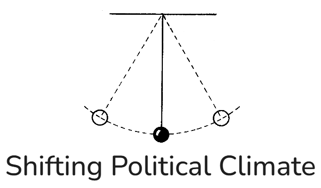
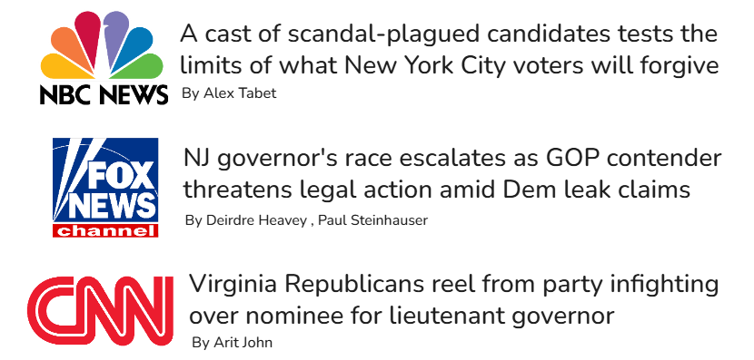
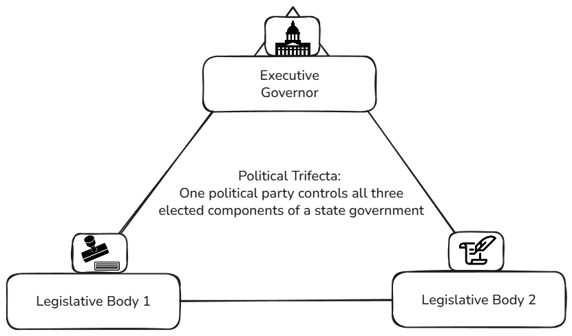
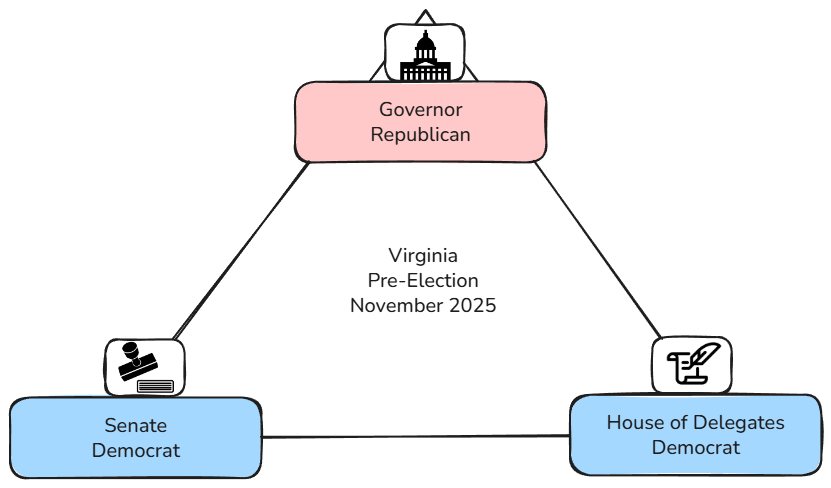
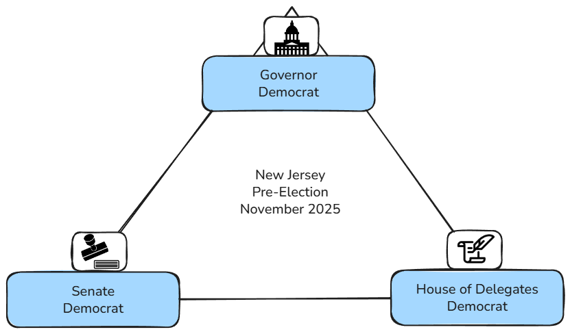
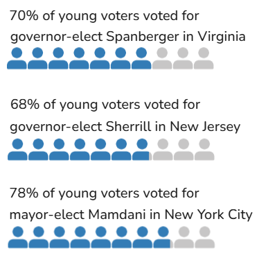
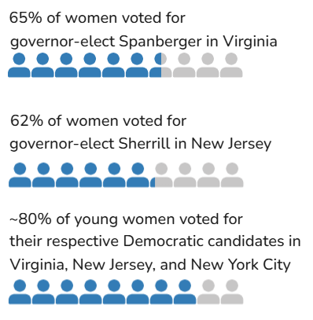
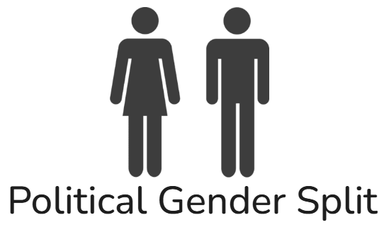
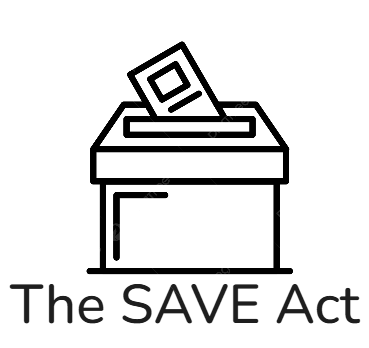

to run this file, install quarto wizard extension, then follow ctrl+shift+p to browse extensions for closeread

The scrolling elements are going to appear on the side when you open up to the full browser, but look like they're over top in the preview pane. The final product will be a scrolling left panel, and a zooming/changing right panel of images

click PREVIEW to see!

I think most of the introduction information will be in the scrollables

When we want to edit the formatting: https://www.gastonsanchez.com/learn-closeread/modules/09-style-formatting.html

:::{.cr-section .overlay}

@cr-features-intro_text

## Introduction
Dana

@cr-features-election_text

November 4, 2025 was the first major election night since the Presidential election in 2024. For the Democratic Party, this was also the first opportunity to gain control of state and local offices after the Republican win for presidency. 

@cr-features-news_headlines

That day, Virginia and New Jersey held state-level elections for their executive offices and some legislative offices, and New York City held its mayoral election. All three races were widely anticipated (Bradner, 2025b) and closely followed by various news outlets, including NBC News, Fox News, and CNN.

@cr-features-trifecta

The two state elections generated so much interest because a ‘Democratic trifecta’ was on the line. A political trifecta occurs when a single political party controls all three major elected components of a state’s government, which usually makes it easier for that party to pass policies. 

@cr-features-va_trifecta

In Virginia’s case, the governor before the elections was Republican, and the two legislative bodies were controlled by the Democratic party. If a Democrat was elected for governor, Virginia would achieve a Democratic trifecta. 

@cr-features-nj_trifecta

New Jersey held a Democratic trifecta before election night, but the races for governor and legislative offices were so close that they had a possibility of losing Democratic control in one of the branches.

@cr-features-mamdani

The New York City race was widely followed for many reasons, including the Democratic Party’s reluctance to back their candidate, Zohran Mamdani, and the support from the President of the United States to the Independent candidate, Andrew Cuomo. 

@cr-features-election_text

All three elections resulted in dramatic Democratic party wins, with Virginia and New Jersey achieving Democratic trifectas, and Zohran Mamdani winning in New York City. In the aftermath of this busy election night, election analysts reviewed exit polling data and learned two important things:

@cr-features-young_votes

The majority of **young people** voted for winning Democratic candidates in all 3 elections. (McHardy, 2025) 

@cr-features-female_votes

The majority of **women** voted for winning Democratic candidates in all 3 elections, especially **young women.** (Dittmar, 2025)

@cr-features-social_media

## Social Media Backlash
Dana

@cr-features-gender_split

## Political Gender Split

If women were so influential in this past election, and prominent men called to rescind women's right to vote, how do women and men in the United States identify politically? The National Public Opinion Reference Survey is an annual survey of adults in the United States, distributed by Pew Research. (cite) From 2020 to 2025, survey respondents were asked what political party they identify with. The following chart shows those responses over time. 

@cr-features-age_lines

Throughout this time period, the largest proportion of **women (~35-40%) identify as Democrat,** while the largest proportion of **men (~32-35%) identify as Republican.** This indicates that a large population of women have very different political identities and interests than a similarly large population of men. 

@cr-features-youth_lines

In the same time period, the survey responses for young adults are more complex. Despite dramatic changes each year, the largest proportion of **young women** in any time period identify as **Democrat**, and the largest proportion of young men identify as either Democrat or Independent. 

However, from 2024-2025, there is a visible disparity where the proportion of **young men who identify as Republican increased** (~22% to ~27%), and the proportion who identify as Independent decreased (~35% to ~27%). At the same time, the proportion of **young women who identify as Democrat dramatically increased** (~34% to ~44%).

@cr-features-gender_split

The NPORS survey has not been issued long enough to calculate trends over time for these survey responses. However, they do provide a visual representation of the differences in political identity between women and men. How do these differences in political identity appear in the issues that women and men care about?

Dana: talk about issues, then it'll move into the issues chart

:::{#cr-features-intro_text}

:::

:::{#cr-features-election_text}

:::

:::{#cr-features-news_headlines}

:::

:::{#cr-features-trifecta}

:::

:::{#cr-features-va_trifecta}

:::

:::{#cr-features-nj_trifecta}

:::

:::{#cr-features-mamdani}

:::

:::{#cr-features-young_votes}

:::

:::{#cr-features-female_votes}

:::

:::{#cr-features-social_media}

:::

:::{#cr-features-gender_split}

:::

:::{#cr-features-age_lines}

:::

:::{#cr-features-youth_lines}

:::

:::

Issues interactive and commentary
<iframe src="charts/issues_dashboard.html" width="1200" height="600"></iframe>

:::{.cr-section .overlay}

@cr-features-gender_split_2

Prominent figures like the Secretary of War declared that women should not have the right to vote. If that happened, women's interests in all of these issues would be underrepresented, and the United States would have a very different political landscape. For example, what would the 2024 Presidential Election have looked like if women did not vote?

:::{#cr-features-gender_split_2}

:::

:::

This map shows the AP VoteCast exit poll responses to the 2024 election. This survey is hosted by the National Opinion Research Center, at the University of Chicago. The state coloration shows the majority opinion from survey respondents, and does not represent the final electoral college or popular vote of the states. Click a state on the left to see an age-group breakdown of the responses in that state on the right. 

To see what the 2024 election would have looked like if women did not vote, toggle the map from "Total" to "Male," and check out the "Female" tab to see how women voted in each state.

<iframe src="charts/map_dash.html" width="1200" height="600"></iframe>

When considering the total survey responses, a roughly even number of states are colored blue (majority Harris) and red (majority Trump). However, considering only male survey responses shows most of the states turn red. By contrast, considering only female survey responses, most states turn blue. This shows that, in most states, there is a divide between how men and women voted, and while Donald Trump won the 2024 election regardless, the margin would have been much larger if women did not vote.

:::{.cr-section .overlay}

@cr-features-save_act_text

Suppression of women’s right to vote is no longer a radical provocation, but a true threat, demonstrated by the **Safeguard American Voter Eligibility (SAVE) Act.**

The SAVE Act would require voters to provide proof of citizenship in person upon voter registration through a valid passport or birth certificate. This requirement would create an additional barrier to voting for many women, who are far more likely to take their spouse’s name, increasing the risk that their birth certificate does not match their legal name. 

A Pew research study (Lin 2023) found that women in opposite-sex marriages are far more likely than men to take their spouse’s last name, though younger, Democratic and highly-educated women are less likely to do so. For women with birth certificates that do not match their current legal names, registering to vote would necessitate additional documentation, such as a marriage certificate.

REAL IDs would not suffice as citizenship proof for the vast majority of Americans, since they demonstrate legal residence and are available to non-citizens.

:::{#cr-features-save_act_text}

:::

The SAVE Act's in-person requirement would pose a greater burden for individuals living in rural areas, farther from voting locations, requiring some to travel hours or even fly to prove citizenship. 

@cr-features-passport_metric

:::{#cr-features-passport_metric}
<iframe 
  src="charts/metric_estimated_without_passport.html"
  width="100%"
  height="650px"
  style="border: none;">
</iframe>
:::

The legislation would also increase the burden of voting for as many as 146 million U.S. citizens without a passport. Research from the Center for American Progress shows that passport ownership is concentrated in blue states and among highly-educated individuals, individuals with higher incomes, and younger individuals. 

Together, these data points indicate that if passed, the SAVE Act could disproportionately impact women living in rural areas, conservative women, and low-income, older women with less education.

To explore which women would be most impacted by the SAVE Act, we aligned state estimates of female citizens whose names may not match their birth certificates with state survey results from the National Opinion Research Center.

Visual analysis reveals a clear state-level pattern of rurality and birth-certificate mismatches. The first visual shows that higher estimated shares of women with birth-certificate name mismatches coincide with higher shares of women living in rural areas. 

@cr-features-rural_scatter

:::{#cr-features-rural_scatter}
<iframe 
  src="charts/Percent_of_Women_At_Risk_vs_Percent_of_Women_Living_in_Rural_Areas.html"
  width="100%"
  height="650px"
  style="border: none;">
</iframe>
:::

State-level comparisons also show that higher estimated shares of women with birth-certificate name mismatches coincide with higher shares of Republican women.

@cr-features-republican_scatter

:::{#cr-features-republican_scatter}
<iframe 
  src="charts/Percent_of_Women_At_Risk_vs_Percent_of_Women_Who_Identify_as_Republican.html"
  width="100%"
  height="650px"
  style="border: none;">
</iframe>
:::

:::